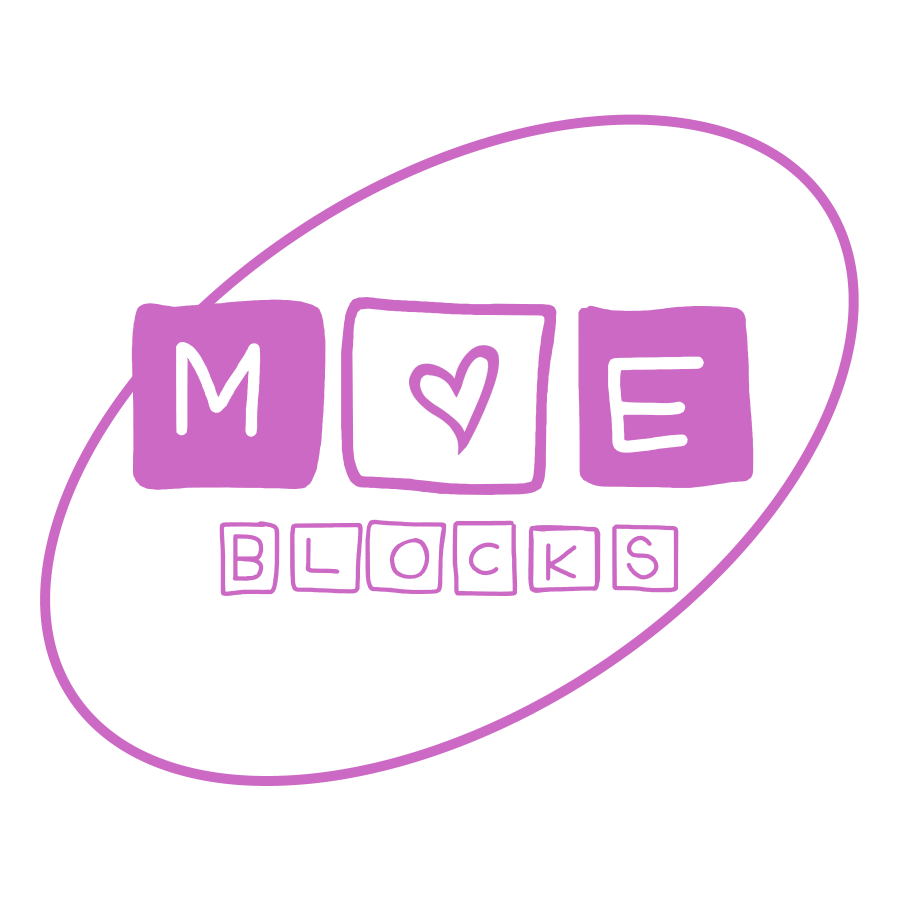
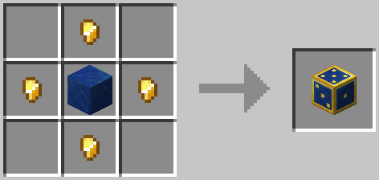

# Moe Blocks
Moe Blocks allows the player to create kawaii creatures known as **moes** (pronounced
_mo-ays_), which act in various ways to gain the player's affection. Moes are
created by rolling a **magical die** that forms the moe from the block it lands on.

## Instructions
To create a Moe, you need to craft a Magical Die with the following recipe:

To throw the die, the player must right click with the die in hand, and it
will fly into the air and roll until it loses momentum, creating the moe with
the block it lands on, and giving it a personality based on the succeeding roll.

The personalities you can achieve with each dice roll are as follows:
1. Himedere, the princess trope that defer responsibilities to fellow moes.
2. Kuudere, the deadpan trope that fancies unusual things.
3. Tsundere, the grumpy trope that won't fall in love without a fight.
4. Yandere, the murderer trope that will be your favorite by process of elimination.
5. Deredere, the lovable trope that loves flowers and cute things.
6. Dandere, the shy trope that has a soft spot for books.

## Important Links
* Report issues on [on GitHub.](https://github.com/Akrivus/MoeBlocks/issues)
* View our [Trello board.](https://trello.com/b/3G3TjQyi/moe-blocks)
* Join our [Discord.](https://www.youtube.com/watch?v=kffacxfA7G4)